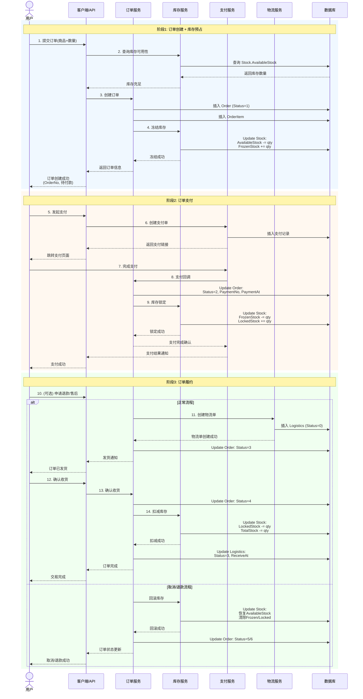
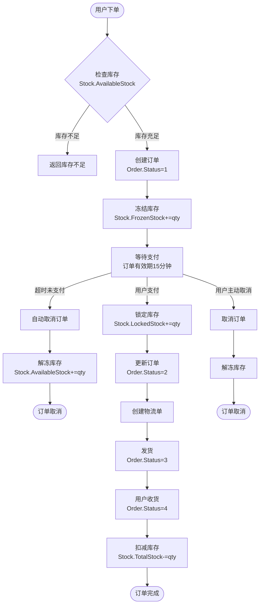
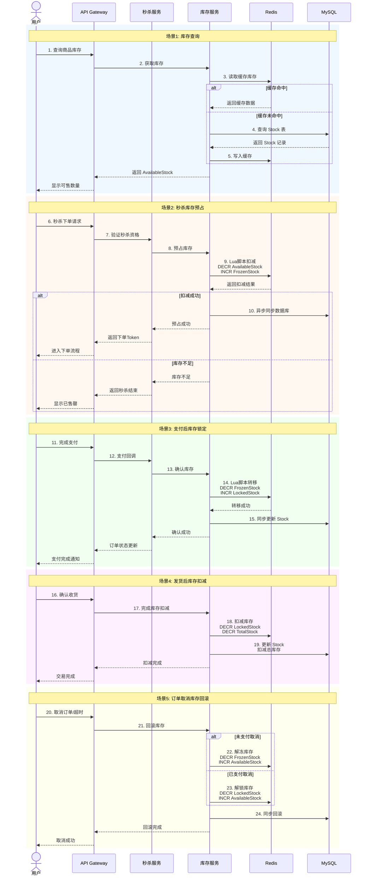
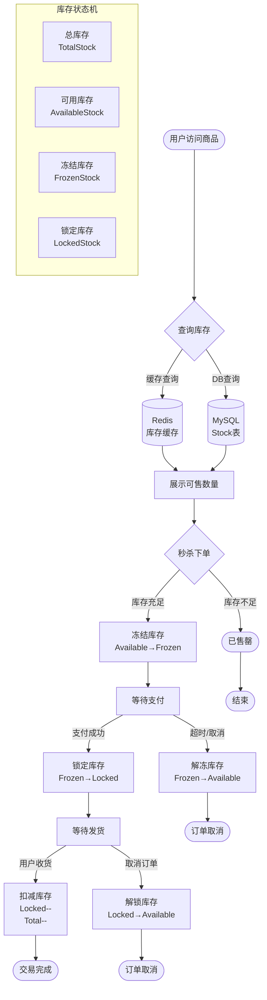
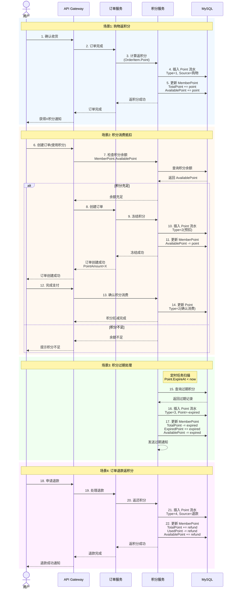
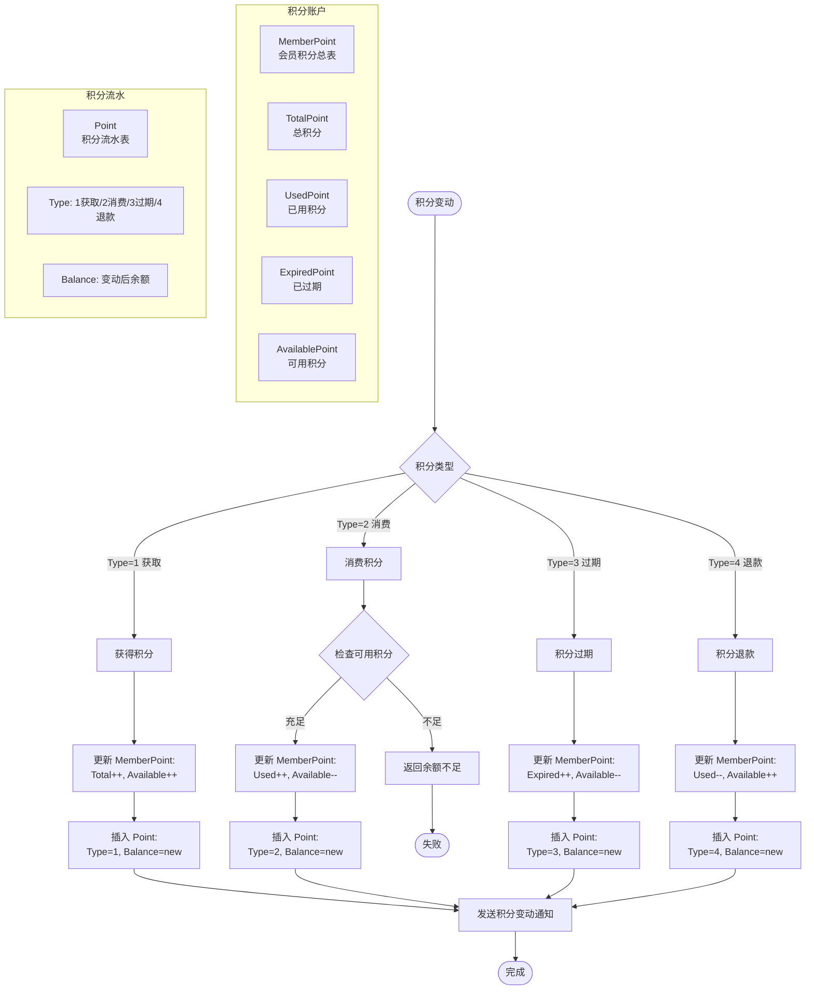
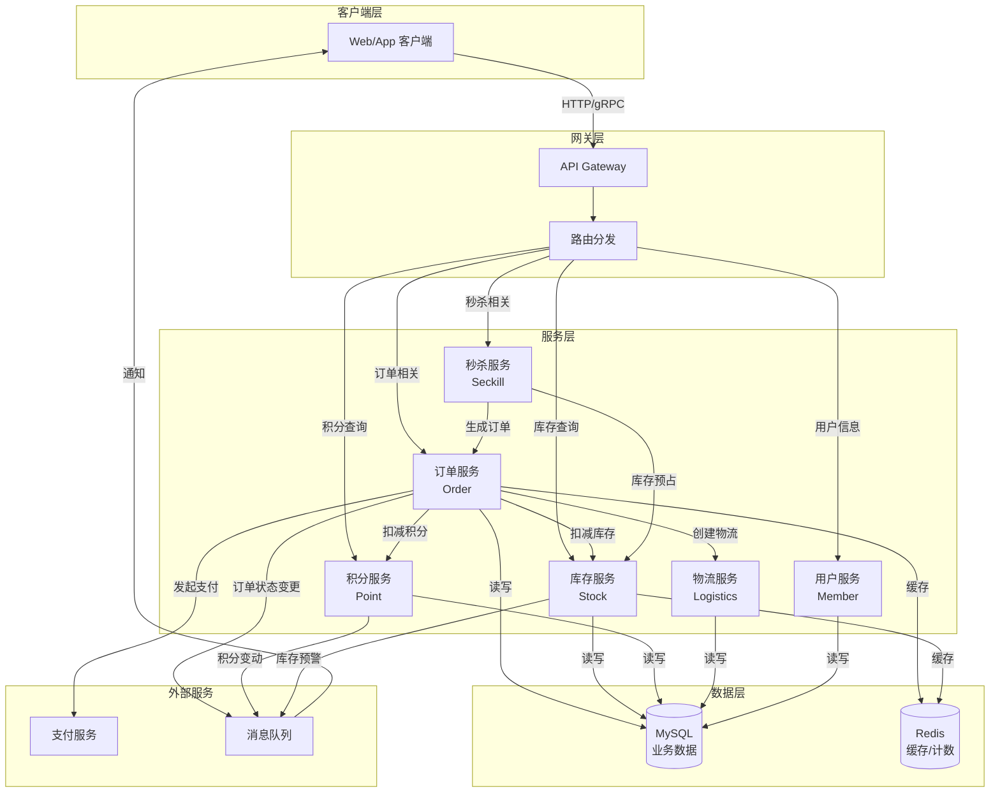
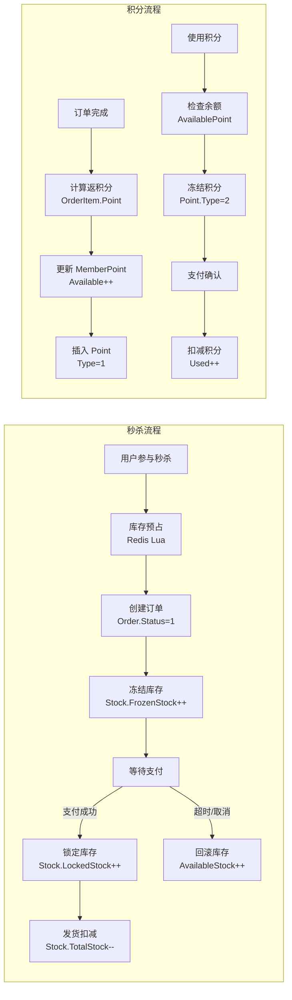
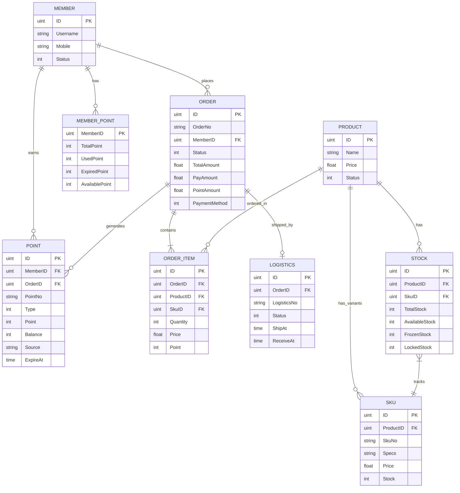

# 秒杀系统业务流程分析文档

> 基于代码库模型定义的业务流程梳理
> 文档版本: v1.0
> 生成时间: 2026-03-14

---

## 目录

1. [订单全流程](#一订单全流程)
2. [库存全流程](#二库存全流程)
3. [积分全流程](#三积分全流程)
4. [数据流程图](#四数据流程图)
5. [核心实体关系](#五核心实体关系)

---

## 一、订单全流程

### 1.1 订单状态定义

基于 `Order` 模型的 `Status` 字段：

| 状态码 | 状态名称 | 说明 |
|--------|----------|------|
| 1 | 待付款 | 订单已创建，等待用户支付 |
| 2 | 待发货 | 已支付，等待商家发货 |
| 3 | 待收货 | 已发货，等待用户确认收货 |
| 4 | 已完成 | 订单完成，交易结束 |
| 5 | 已取消 | 订单被取消（超时/主动取消） |
| 6 | 售后 | 订单进入售后流程 |

### 1.2 订单时序图



### 1.3 订单数据流图



---

## 二、库存全流程

### 2.1 库存状态定义

基于 `Stock` 模型的库存状态：

| 字段 | 说明 | 计算关系 |
|------|------|----------|
| TotalStock | 总库存 | 物理库存总量 |
| AvailableStock | 可用库存 | 可售卖的库存 |
| FrozenStock | 冻结库存 | 已下单未支付，占用中 |
| LockedStock | 锁定库存 | 已支付，待发货 |

**库存公式**: `TotalStock = AvailableStock + FrozenStock + LockedStock`

### 2.2 库存时序图



### 2.3 库存数据流图



---

## 三、积分全流程

### 3.1 积分类型定义

基于 `Point` 模型的 `Type` 字段：

| 类型码 | 类型名称 | 触发场景 |
|--------|----------|----------|
| 1 | 获取 | 购物返积分、签到、活动奖励 |
| 2 | 消费 | 积分抵扣订单金额 |
| 3 | 过期 | 积分到期自动清零 |
| 4 | 退款 | 订单退款返还积分 |

### 3.2 积分时序图



### 3.3 积分数据流图



---

## 四、数据流程图

### 4.1 系统整体数据流



### 4.2 核心业务流程数据流



---

## 五、核心实体关系

### 5.1 数据库实体关系图



### 5.2 关键字段说明

#### Order 订单表
- `OrderNo`: 唯一订单号
- `Status`: 1待付款/2待发货/3待收货/4已完成/5已取消/6售后
- `TotalAmount`: 订单总额
- `PayAmount`: 实付金额
- `PointAmount`: 积分抵扣金额
- `PaymentMethod`: 1微信/2支付宝/3积分

#### Stock 库存表
- `TotalStock`: 总库存数量
- `AvailableStock`: 可用库存(可售卖)
- `FrozenStock`: 冻结库存(已下单未支付)
- `LockedStock`: 锁定库存(已支付待发货)

#### Point 积分流水表
- `Type`: 1获取/2消费/3过期/4退款
- `Point`: 变动积分数(正数增加,负数减少)
- `Balance`: 变动后的积分余额
- `ExpireAt`: 积分过期时间

#### MemberPoint 会员积分总表
- `TotalPoint`: 累计获得积分
- `UsedPoint`: 已使用积分
- `ExpiredPoint`: 已过期积分
- `AvailablePoint`: 当前可用积分

---

## 附录：模型定义源码

### Order 订单模型
```go
type Order struct {
    ID             uint       `gorm:"primaryKey;comment:'订单ID'"`
    OrderNo        string     `gorm:"type:varchar(50);uniqueIndex;not null;comment:'订单号'"`
    MemberID       uint       `gorm:"index;not null;comment:'会员ID'"`
    Status         int        `gorm:"type:tinyint(2);default:1;comment:'状态:1待付款2待发货3待收货4已完成5已取消6售后'"`
    TotalAmount    float64    `gorm:"type:decimal(10,2);not null;comment:'订单总额'"`
    PayAmount      float64    `gorm:"type:decimal(10,2);not null;comment:'实付金额'"`
    PointAmount    float64    `gorm:"type:decimal(10,2);default:0;comment:'积分抵扣'"`
    PaymentMethod  int        `gorm:"type:tinyint(1);comment:'支付方式:1微信2支付宝3积分'"`
    CreatedAt      time.Time  `gorm:"comment:'下单时间'"`
}
```

### Stock 库存模型
```go
type Stock struct {
    ID             uint       `gorm:"primaryKey;comment:'库存ID'"`
    ProductID      uint       `gorm:"uniqueIndex;not null;comment:'商品ID'"`
    TotalStock     int        `gorm:"default:0;comment:'总库存'"`
    AvailableStock int        `gorm:"default:0;comment:'可用库存'"`
    FrozenStock    int        `gorm:"default:0;comment:'冻结库存(已下单未支付)'"`
    LockedStock    int        `gorm:"default:0;comment:'锁定库存(已支付)'"`
}
```

### Point 积分模型
```go
type Point struct {
    ID        uint       `gorm:"primaryKey;comment:'积分ID'"`
    MemberID  uint       `gorm:"index;not null;comment:'会员ID'"`
    OrderID   uint       `gorm:"index;comment:'订单ID'"`
    Type      int        `gorm:"type:tinyint(1);comment:'类型:1获取2消费3过期4退款'"`
    Point     int        `gorm:"not null;comment:'积分数值'"`
    Balance   int        `gorm:"default:0;comment:'积分余额'"`
    ExpireAt  *time.Time `gorm:"type:datetime;comment:'过期时间'"`
}
```

---

**文档结束**
**记录时间**: 基于当前代码库模型定义分析
**数据来源**: server/models/model.go
